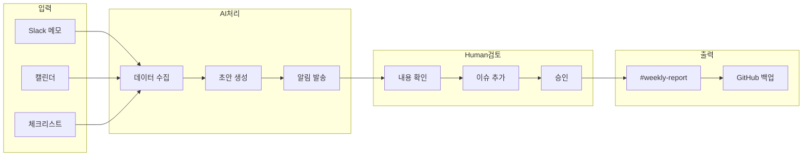

# 주간보고 프로세스 다이어그램

> **용도**: 피그마 개념도 제작용 콘텐츠
> **버전**: v0.1.0

---

## 1. 전체 흐름

```
┌─────────────────────────────────────────────────────────────────────────┐
│                        주간보고 프로세스                                  │
├─────────────────────────────────────────────────────────────────────────┤
│                                                                         │
│   [월~수]              [목 오전]              [목 14:00]                 │
│                                                                         │
│   담당C               비서실장               담당C                       │
│   일일 메모            초안 생성              검토/수정                   │
│      │                   │                     │                        │
│      ▼                   ▼                     ▼                        │
│   ┌──────┐           ┌──────┐             ┌──────┐                      │
│   │Slack │──────────▶│Claude│────────────▶│검토  │                      │
│   │메모  │           │초안  │             │승인  │                      │
│   └──────┘           └──────┘             └──────┘                      │
│                                                │                        │
│                                                ▼                        │
│                                          ┌──────────┐                   │
│                                          │#weekly   │                   │
│                                          │-report   │                   │
│                                          │게시      │                   │
│                                          └──────────┘                   │
│                                                                         │
└─────────────────────────────────────────────────────────────────────────┘
```

---

## 2. 역할 분담

### 🤖 AI (비서실장/Claude)

| 단계 | 작업 | 입력 | 출력 | 자동화 |
|------|------|------|------|--------|
| 1 | 데이터 수집 | Slack 메모, 캘린더 | 원시 데이터 | ✅ 자동 |
| 2 | 초안 생성 | 템플릿 + 데이터 | 주간보고 초안 | ✅ 자동 |
| 3 | 리마인더 | 목 10:00 | 알림 메시지 | ✅ 자동 |

### 👤 Human (담당 컨설턴트)

| 단계 | 작업 | 입력 | 출력 | 필수 |
|------|------|------|------|------|
| 1 | 일일 메모 | 업무 내용 | #daily-log 1~2줄 | ✅ |
| 2 | 초안 검토 | AI 초안 | 수정/보완 | ✅ |
| 3 | 최종 승인 | 검토본 | 게시 승인 | ✅ |
| 4 | 이슈 판단 | 현장 상황 | 리스크 평가 | ✅ |

---

## 3. 산출물 규격

### 📄 주간보고서

| 항목 | 규격 |
|------|------|
| **파일명** | `주간보고_[프로젝트코드]_YYYYMMDD.md` |
| **예시** | `주간보고_KSC-2026-001-JDA_20260604.md` |
| **버전** | 프로젝트당 주간 순번 (W01, W02...) |
| **채널** | #weekly-report |
| **형식** | Markdown (Slack 캔버스) |
| **보존** | GitHub 아카이브 (월간) |

### 📊 버전 체계

```
주간보고_[프로젝트코드]_[날짜]_[버전].md

예시:
- 주간보고_KSC-2026-001-JDA_20260604_W01.md  ← 1주차
- 주간보고_KSC-2026-001-JDA_20260611_W02.md  ← 2주차
- 주간보고_KSC-2026-001-JDA_20260618_W03.md  ← 3주차
```

### 📐 필수 섹션 (7개)

| # | 섹션 | 작성자 | 필수 |
|---|------|--------|------|
| 1 | 기본 정보 | AI | ✅ |
| 2 | 이번 주 완료 | AI+Human | ✅ |
| 3 | 다음 주 계획 | AI+Human | ✅ |
| 4 | 이슈/리스크 | Human | ✅ |
| 5 | 결정 필요 사항 | Human | 선택 |
| 6 | 예산 현황 | Human | ✅ |
| 7 | 발주처 소통 | Human | ✅ |

---

## 4. 타임라인

```
┌────────────────────────────────────────────────────────────┐
│ 월   화   수   목                                          │
│ ─────────────────────────────────────────────────────────  │
│                                                            │
│ [담당C]                                                    │
│ ├── 일일 메모 ──┼── 일일 메모 ──┼── 일일 메모 ──┤          │
│                                                            │
│                              [비서실장]                     │
│                              ├── 10:00 초안 생성            │
│                              │                             │
│                              [담당C]                        │
│                              ├── 10:00~14:00 검토           │
│                              │                             │
│                              [시스템]                       │
│                              └── 14:00 자동 게시            │
│                                                            │
└────────────────────────────────────────────────────────────┘
```

---

## 5. 피그마 박스 텍스트

### 박스 1: 입력 (Input)
```
📥 입력
─────────
• Slack #daily-log 메모
• 캘린더 일정
• 이전 주간보고
• 프로젝트 체크리스트
```

### 박스 2: AI 처리 (Process)
```
🤖 AI 처리
─────────
• 메모 수집 & 정리
• 템플릿 적용
• 초안 생성
• Slack 알림
```

### 박스 3: Human 검토 (Review)
```
👤 Human 검토
─────────
• 내용 확인
• 이슈 판단 추가
• 예산 업데이트
• 발주처 소통 기록
```

### 박스 4: 출력 (Output)
```
📤 출력
─────────
• #weekly-report 게시
• 대표 알림
• GitHub 백업 (월간)
```

---

## 6. 색상 가이드 (피그마용)

| 요소 | 색상 | HEX |
|------|------|-----|
| AI 작업 | 파랑 | #3B82F6 |
| Human 작업 | 초록 | #10B981 |
| 자동화 | 보라 | #8B5CF6 |
| 산출물 | 주황 | #F59E0B |
| 필수 | 빨강 | #EF4444 |
| 선택 | 회색 | #6B7280 |

---

## 7. Mermaid 다이어그램 (피그마 참고용)



---

*피그마에서 이 내용을 기반으로 시각화하세요*
